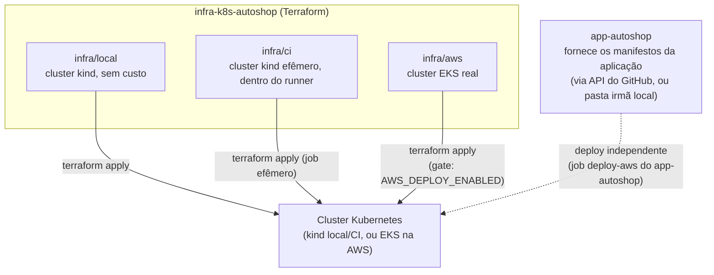

# infra-k8s-autoshop

Provisionamento do cluster Kubernetes usado pela aplicação
[`app-autoshop`](https://github.com/Jackeline2020/app-autoshop) — Terraform
puro, sem nenhum manifesto da aplicação.

Este é o repositório 2 dos 4 exigidos pela Fase 3 do Tech Challenge. Os
outros três: [`app-autoshop`](https://github.com/Jackeline2020/app-autoshop)
(aplicação), [`infra-db-autoshop`](https://github.com/Jackeline2020/infra-db-autoshop)
(banco gerenciado) e [`lambda-auth-autoshop`](https://github.com/Jackeline2020/lambda-auth-autoshop)
(autenticação por CPF).

## O que este repositório NÃO faz (e por quê)

Depois de esclarecimento direto do professor da disciplina, este
repositório foi reorganizado pra conter **só** o que é infraestrutura do
cluster: cluster em si, node groups, rede, add-ons (metrics-server),
autoscaling de infraestrutura. Os manifestos da aplicação (Deployment,
Service, HPA, ConfigMap, Secret, ServiceAccount) moram e são versionados no
[`app-autoshop`](https://github.com/Jackeline2020/app-autoshop) — a ideia é
separar o ciclo de vida da infraestrutura do ciclo de vida da aplicação:
provisionar um cluster é uma operação rara e cara; fazer deploy de uma
nova versão da aplicação acontece a cada push.

## Arquitetura



- **`local/` e `ci/`**: como o cluster kind é efêmero e só existe dentro
  do próprio job (local: na sua máquina; CI: no runner), este Terraform
  ainda aplica os manifestos da aplicação — mas o conteúdo desses
  manifestos vem do `app-autoshop` (variáveis `TF_VAR_*`, populadas
  localmente lendo a pasta irmã, e na CI baixando via API do GitHub). Os
  arquivos continuam pertencendo ao `app-autoshop`; este repositório só os
  consome de forma read-only pra viabilizar o teste efêmero.
- **`aws/`**: cria só o cluster EKS (node groups, rede, IRSA, acesso via
  OIDC). Quem faz o deploy da aplicação nele é o próprio `app-autoshop`,
  de forma totalmente independente (via `kubectl apply` autenticado com a
  mesma role compartilhada via OIDC).

Mais detalhes técnicos de cada pasta Terraform em [`docs/infra.md`](docs/infra.md).

## Tecnologias

- Terraform (providers `kind`, `kubectl`, `helm`, `aws`)
- Kubernetes (kind para local/CI, EKS na AWS)
- GitHub Actions
- AWS (EKS, IAM/OIDC) para o ambiente de produção

## Pré-requisitos

- Terraform >= 1.5
- Docker + CLI `kind` (`winget install Kubernetes.kind`) para uso local
- Repositório `app-autoshop` clonado como pasta irmã (`../app-autoshop`),
  necessário pra ler os manifestos da aplicação localmente

## Como aplicar

Ver o passo a passo completo (local e AWS) em [`docs/infra.md`](docs/infra.md).
Resumo do fluxo local:

```bash
cd infra/local
export TF_VAR_migration_sql="$(cat ../../../app-autoshop/migrations/000001_init_schema.up.sql)"
export TF_VAR_deployment_yaml="$(cat ../../../app-autoshop/k8s/base/deployment.yaml)"
export TF_VAR_service_yaml="$(cat ../../../app-autoshop/k8s/base/service.yaml)"
export TF_VAR_hpa_yaml="$(cat ../../../app-autoshop/k8s/base/hpa.yaml)"
export TF_VAR_configmap_yaml="$(cat ../../../app-autoshop/k8s/overlays/local/configmap.yaml)"
export TF_VAR_secret_yaml="$(cat ../../../app-autoshop/k8s/overlays/local/secret.yaml)"
export TF_VAR_serviceaccount_yaml="$(cat ../../../app-autoshop/k8s/overlays/local/serviceaccount.yaml)"

terraform init
terraform apply -target="kind_cluster.autoshop"
docker build -t autoshop-api:latest ../../../app-autoshop
kind load docker-image autoshop-api:latest --name autoshop-local
terraform apply
```

## Pipeline CI/CD (`.github/workflows/ci-cd.yml`)

1. **terraform-validate** — valida o Terraform de `infra/ci` em toda PR.
2. **deploy-local** — (disparado pelo `app-autoshop` via `repository_dispatch`
   quando algo é publicado em `develop`, ou manualmente via
   `workflow_dispatch`) sobe um cluster kind efêmero, busca os manifestos
   da aplicação no `app-autoshop`, aplica tudo, roda a migration, espera o
   rollout, faz smoke test e destrói o cluster — é o ambiente de
   homologação, sem custo de nuvem.
3. **deploy-aws** — (disparado quando `app-autoshop` publica em `main`, se
   a variável `AWS_DEPLOY_ENABLED=true`) roda `terraform apply` em
   `infra/aws`: provisiona/atualiza só o cluster EKS. Não mexe em nada da
   aplicação — isso é feito pelo `app-autoshop` de forma independente.

Secrets necessários: `APP_REPO_READ_TOKEN` (lê os manifestos do
`app-autoshop`), `AWS_ROLE_ARN`, `RDS_SECRET_ARN`.
Variável: `AWS_DEPLOY_ENABLED`.
